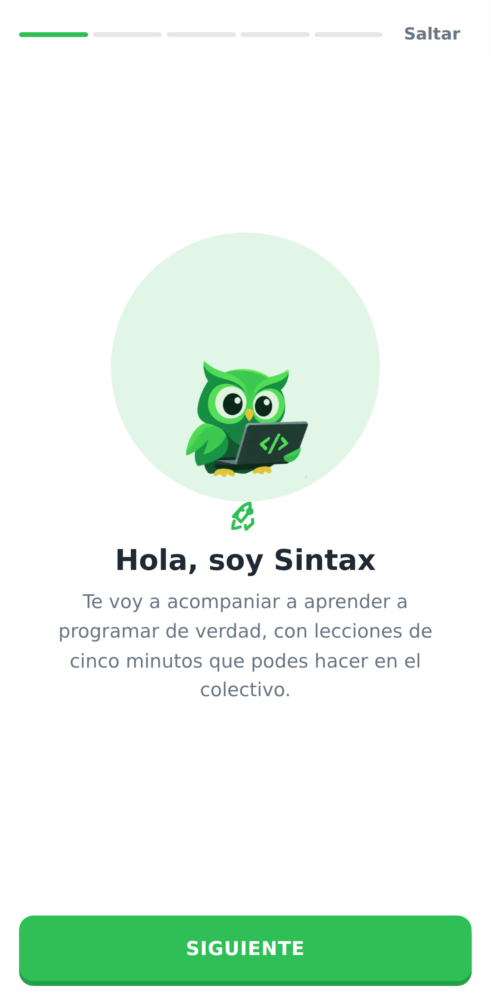
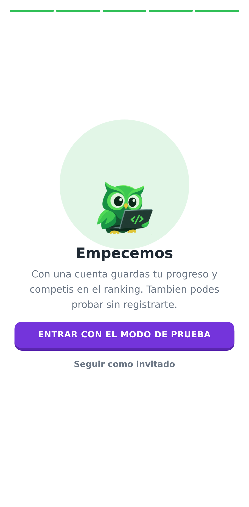
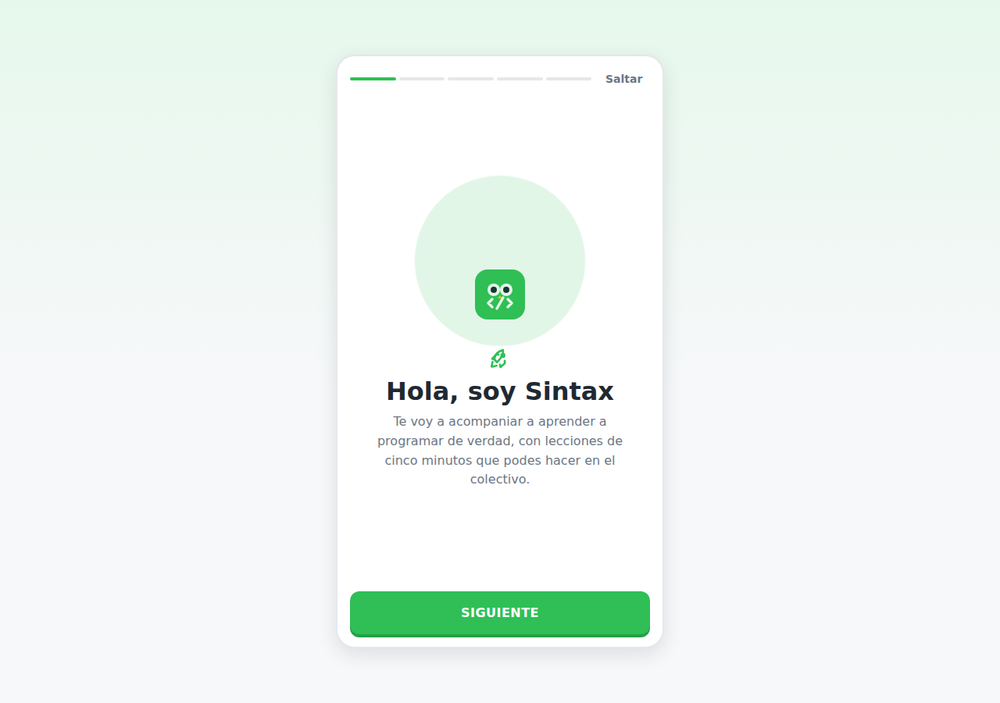

# Sintaxia · Aprende a programar jugando

Aplicacion web estilo **Duolingo pero para lenguajes de programacion**, desarrollada con
**Vue 3 + Vite + Vue Router** y un backend propio de **Node.js + Express + MySQL**.

Lecciones de cinco minutos, ejercicios interactivos con correccion inmediata, vidas, XP,
rachas, medallas y un camino de unidades que se va desbloqueando. Se puede practicar sin
cuenta o **iniciar sesion con Google o GitHub** para guardar el progreso en la base de datos.

El curso implementado es el de **JavaScript**: 6 unidades, 14 lecciones y 44 ejercicios de
4 tipos distintos.


---

## Como ejecutarlo

### Solo el front (sin backend)

```bash
npm install
npm run dev        # http://localhost:5173
```

Funciona igual: sin servidor, la app entra en **modo invitado** y guarda el progreso en el
navegador.

### Completo, con cuentas y base de datos

```bash
npm install
cp .env.example .env
#   Genera el secreto de sesion:
#   node -e "console.log(require('crypto').randomBytes(48).toString('hex'))"

npm run db:migrar     # crea la base y las 6 tablas
npm run db:sembrar    # carga el catalogo de 14 medallas
npm run dev:todo      # front en :5173 y API en :3000
```

Requiere **Node 18+** y **MySQL 8** (o MariaDB 10.6+). Con `PERMITIR_LOGIN_DEMO=true` en el
`.env` se puede entrar sin configurar credenciales de Google ni de GitHub.

| Script | Que hace |
|---|---|
| `npm run dev` | Solo el front |
| `npm run dev:api` | Solo la API, recargando al guardar |
| `npm run dev:todo` | Los dos a la vez |
| `npm run build` | Compila el front a `/dist` |
| `npm run db:migrar` | Crea la base y las tablas |
| `npm run db:sembrar` | Carga o actualiza las medallas |

---

## El logo

El logo vive en **`public/sintax/sintaxia.png`**. Con solo dejar el archivo ahi aparece en la cabecera,
el pie, la portada, la pantalla de ingreso, el 404 y como favicon: no hay que tocar codigo.

Mientras ese archivo no exista, la app dibuja un logo de respaldo en SVG, asi que nunca se ve
una imagen rota.

El componente `LogoSintaxia.vue` tiene dos variantes:

| Variante | Que muestra | Donde se usa |
|---|---|---|
| `icono` | Recorte cuadrado centrado en el buho | Cabecera, pie, 404 |
| `completo` | La imagen entera, con la palabra "Sintaxia" | Portada y pantalla de ingreso |

El recorte de la variante `icono` se ajusta con dos variables CSS, por si el buho queda
descentrado con otra version del logo:

```css
.logo--icono {
  --logo-zoom: 275%;    /* cuanto se agranda la imagen */
  --logo-foco-y: 30%;   /* que franja vertical queda a la vista */
}
```

Los valores salen de medir el PNG: el buho ocupa de `y=167` a `y=673` y la palabra arranca
justo debajo.

## Pensada tambien para el celular

La aplicacion tiene que funcionar igual en la web y en un telefono Android, asi que:

- **Bienvenida tipo app.** La primera vez que se abre, aparece una presentacion de cuatro
  pasos que se pasan deslizando y termina ofreciendo entrar con Google, con GitHub o seguir
  como invitado. En el escritorio se muestra encuadrada con el ancho de un celular.
- **Carruseles con `scroll-snap` del navegador**, no movidos con JavaScript: el gesto lo
  maneja el sistema, asi que se siente igual que en una app nativa (sigue el dedo y frena
  con inercia).
- **Se respetan la muesca y la barra de gestos** con `env(safe-area-inset-*)`.
- **Areas tocables comodas**: los puntos del carrusel miden 9 px pero se pueden tocar en un
  area de 31 px.
- Las flechas de los carruseles **solo aparecen si hay algo que desplazar**, y se esconden
  en pantallas chicas, donde se navega con el dedo.

## Sintax, la mascota

El buho del logo aparece en toda la aplicacion y **reacciona a lo que pasa**: celebra una
leccion perfecta, se enoja cuando se pierden las tres vidas, se confunde en el 404 y duerme
si hace rato que no practicas.

Las imagenes viven en **`public/sintax/`**, una por estado de animo:

| Archivo | Que muestra | Cuando aparece |
|---|---|---|
| `normal.webp` | Con la notebook, contento | Por defecto, y reemplaza a cualquiera que falte |
| `saludando.webp` | Alas arriba, ojos cerrados | Portada, ingreso y bienvenida |
| `confundido.webp` | Ala en el pico y un "?" | Pagina 404 y resultados flojos |
| `pensando.webp` | La lamparita de la idea | Pantallas vacias |
| `enojado.webp` | Notebook con la X roja | Cuando se pierden las tres vidas |
| `dormido.webp` | Acostado, con Zzz | Cuando todavia no empezaste |
| `celebrando.webp` | Anteojos de sol y destello | Leccion perfecta y racha de 3 dias o mas |
| `sorprendido.webp` | Ojos grandes, ala levantada | Al desbloquear algo nuevo |

Estan en **WebP**: pesan unas cinco veces menos que el PNG con la misma calidad (44 KB
contra 218 KB), que en el celular con datos moviles se nota. El componente igual acepta los
dos formatos.

Cada estado trae su propia animacion (flota, saluda, festeja, tiembla, duerme). Si falta un
archivo se prueba el PNG, despues `normal`, y por ultimo el logo: nunca queda una imagen
rota.

## Iconos

59 iconos SVG dibujados dentro del proyecto (`src/assets/iconos.js`), sin librerias ni CDN.
Heredan el color del texto, asi que cambian solos segun el contexto.

```vue
<Icono nombre="llama" :tamano="16" />
<Icono nombre="trofeo" :tamano="40" etiqueta="Curso completado" />
```

## Documentacion del trabajo practico

| Documento | Contenido |
|---|---|
| [1. Descripcion del proyecto](docs/01-descripcion-del-proyecto.md) | Objetivo, problema que resuelve, publico objetivo y funcionalidades |
| [2. Estructura y arquitectura](docs/02-estructura-y-arquitectura.md) | Vistas, rutas, carpetas, modelo de datos y comunicacion entre componentes |
| [3. Wireframes](docs/03-wireframes.md) | Bocetos de todas las pantallas principales, incluida la version movil |
| [4. Identidad visual](docs/04-identidad-visual.md) | Paleta, tipografias, botones, tarjetas, iconos y su justificacion |
| [5. Backend, autenticacion y base de datos](docs/05-backend-autenticacion-y-base-de-datos.md) | Modelo de datos, flujo OAuth, endpoints, medallas, ranking y seguridad |
| [6. Reglas de avance y finalizacion](docs/06-reglas-de-avance.md) | Completada contra aprobada, umbral, desbloqueo de lecciones y unidades |
| [7. Registro de pruebas](docs/07-registro-de-pruebas.md) | Los 11 casos probados, con problemas encontrados y correcciones |
| [8. Modelo de datos (DER)](docs/08-modelo-de-datos.md) | Tablas, tipos, claves y restricciones · diagrama en draw.io |
| [9. Demostracion](docs/09-demostracion.md) | Guion para mostrar el recorrido completo |

---

## Pantallas

### Catalogo de cursos
Tarjetas reutilizables con buscador y filtros por estado.


### Curso de JavaScript
El camino de unidades, cada una con su estado y su progreso.


### Resolver un ejercicio
Pantalla completa, sin distracciones, con barra de progreso y vidas.


### Correccion inmediata
Al comprobar, la barra inferior dice si estuvo bien, cual era la respuesta y por que.


### Resultados


### Bienvenida
Lo primero que se ve al abrir la aplicacion: cuatro pasos que se pasan deslizando y terminan
ofreciendo entrar con una cuenta o seguir como invitado. En el escritorio se muestra
encuadrada con el ancho de un celular.

<p>
  
  
</p>



### Iniciar sesion
Google y GitHub. Los botones aparecen solo si el servidor tiene cargadas esas credenciales.


### Perfil con cuenta
Medallas, calendario de actividad, liga, racha maxima y puesto en el ranking.


### Medalla desbloqueada
Al terminar una leccion, las medallas que otorga el servidor se festejan en los resultados.


### Ranking semanal


### En telefono


---

## Estructura del proyecto

```
src/
├── api/               cliente.js — todas las llamadas a la API
├── servicios/         contenido.js — modulo unico de acceso al contenido
├── assets/styles/     variables.css (identidad visual) + main.css
├── router/            10 rutas con nombre
├── data/              cursos, unidades, lecciones y ejercicios (nada en el HTML)
├── composables/       useAuth.js (sesion) · useProgreso.js (invitado o cuenta)
├── utils/             verificarRespuesta.js
├── components/        BaseBoton, BarraProgreso, BarraFeedback, MedallaCard,
│                      CalendarioActividad, CursoCard, UnidadCard,
│                      layout/ y ejercicios/
└── views/             una por ruta

server/
├── index.js           Express: middlewares, rutas y manejo de errores
├── config.js          Variables de entorno y validacion al arrancar
├── auth/              sesion.js (cookie JWT) · oauth.js (Google y GitHub)
├── db/                pool.js · migrar.js · sembrar.js · medallas.js · sql/
├── servicios/         usuarios · progreso · medallas · ranking
├── middleware/        autenticar.js
└── rutas/             auth · perfil · progreso · ranking
```

Detalle completo en [docs/02-estructura-y-arquitectura.md](docs/02-estructura-y-arquitectura.md).

---

## La unidad desarrollada

La **Unidad 1 - Primeros pasos** es la que esta desarrollada por completo para
esta etapa:

| Leccion | Teoria | Actividades |
|---|---|---|
| 1. Que es JavaScript | Explicacion + ejemplo con `console.log` | 4 de opcion multiple |
| 2. Variables y constantes | Explicacion + ejemplo con `let` y `const` | 4 de opcion multiple |
| 3. Tipos de datos | Explicacion + ejemplo con `typeof` | 4 de opcion multiple |

Cada leccion abre en su **pantalla de teoria**, con la explicacion y un ejemplo
de codigo que conserva el formato y se lee en el celular, y desde ahi se pasa a
las actividades. Las reglas de avance estan en
[docs/06](docs/06-reglas-de-avance.md).

Las otras cinco unidades tienen su teoria escrita y quedan **bloqueadas** hasta
completar la anterior.

## Contenido del curso de JavaScript

| Unidad | Titulo | Lecciones | Ejercicios |
|---|---|---|---|
| 1 | Primeros pasos | 3 | 11 |
| 2 | Operadores y decisiones | 3 | 9 |
| 3 | Bucles y repeticion | 2 | 6 |
| 4 | Funciones | 2 | 6 |
| 5 | Arrays y objetos | 2 | 6 |
| 6 | JavaScript en la pagina | 2 | 6 |
| | **Total** | **14** | **44** |

### Tipos de ejercicio

| Tipo | Como se responde |
|---|---|
| Opcion multiple | Se elige una entre varias opciones (se mezclan en cada intento) |
| Verdadero o falso | Dos botones grandes |
| Completar el codigo | Se escribe la palabra que falta dentro de un bloque de codigo |
| Ordenar bloques | Se tocan los bloques para armar el codigo en el orden correcto |

---

## Reglas del juego

- **3 vidas por leccion.** Si se pierden las tres, la leccion no se aprueba ni suma XP.
- **XP por leccion**, proporcional a los aciertos. Al repetirla se gana la mitad.
- **Las unidades se desbloquean de a una**: hay que completar todas las lecciones de la
  anterior.
- **Racha diaria**: sube si se practico ayer, vuelve a 1 si se corto.
- **Meta diaria** configurable en el perfil (20, 50 o 100 XP).
- **14 medallas** en cuatro niveles (bronce, plata, oro y diamante). Las otorga el servidor,
  nunca el navegador.
- **Ranking semanal** por XP, que arranca de cero todos los lunes, y **ligas** segun el XP
  total acumulado.

## Cuentas y progreso

| | Invitado | Con cuenta |
|---|---|---|
| Practicar y ver resultados | si | si |
| Donde se guarda | navegador | MySQL |
| Se pierde al limpiar el navegador | si | no |
| Medallas | 7, calculadas localmente | 14, otorgadas por el servidor |
| Calendario de actividad | — | si |
| Ranking y ligas | solo mirar | competir |

Al iniciar sesion, lo que hiciste como invitado **se sube solo** y se fusiona con la cuenta
sin pagar XP dos veces por la misma leccion.

---

## Nota sobre el repositorio

Este repositorio contenia un ejercicio de animacion CSS. Se conservo sin cambios en
[`legacy/animacion/`](legacy/animacion/) y el proyecto Vue se monto alrededor. El violeta de
la identidad visual (`#7434db`) es justamente el color de aquel ejercicio.
