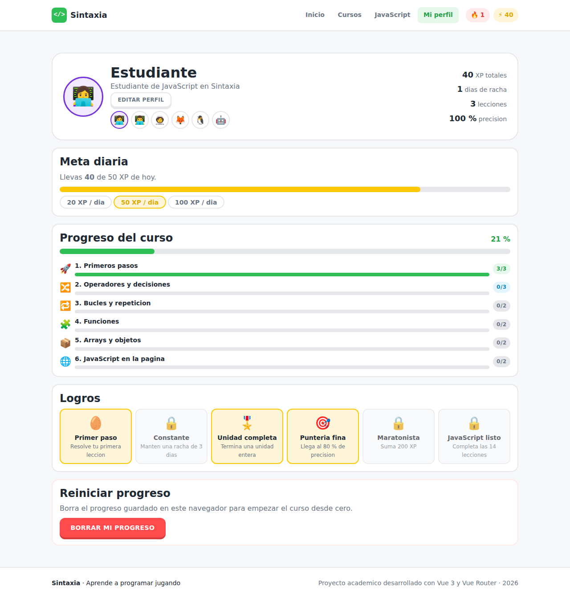

# Sintaxia · Aprende a programar jugando

Aplicacion web estilo **Duolingo pero para lenguajes de programacion**, desarrollada con
**Vue 3 + Vite + Vue Router**.

Lecciones de cinco minutos, ejercicios interactivos con correccion inmediata, vidas, XP,
rachas, logros y un camino de unidades que se va desbloqueando. El curso implementado es el
de **JavaScript**: 6 unidades, 14 lecciones y 44 ejercicios de 4 tipos distintos.


---

## Como ejecutarlo

```bash
npm install
npm run dev        # servidor de desarrollo en http://localhost:5173
npm run build      # compila a /dist
npm run preview    # sirve la version compilada
```

Requiere Node 18 o superior. No hace falta ninguna base de datos ni backend: el progreso se
guarda en el `localStorage` del navegador.

---

## Documentacion del trabajo practico

| Documento | Contenido |
|---|---|
| [1. Descripcion del proyecto](docs/01-descripcion-del-proyecto.md) | Objetivo, problema que resuelve, publico objetivo y funcionalidades |
| [2. Estructura y arquitectura](docs/02-estructura-y-arquitectura.md) | Vistas, rutas, carpetas, modelo de datos y comunicacion entre componentes |
| [3. Wireframes](docs/03-wireframes.md) | Bocetos de todas las pantallas principales, incluida la version movil |
| [4. Identidad visual](docs/04-identidad-visual.md) | Paleta, tipografias, botones, tarjetas, iconos y su justificacion |

---

## Pantallas

### Catalogo de cursos
Tarjetas reutilizables con buscador y filtros por estado.


### Curso de JavaScript
El camino de unidades, cada una con su estado y su progreso.


### Resolver un ejercicio
Pantalla completa, sin distracciones, con barra de progreso y vidas.


### Correccion inmediata
Al comprobar, la barra inferior dice si estuvo bien, cual era la respuesta y por que.


### Resultados


### Perfil



### En telefono


---

## Estructura del proyecto

```
src/
├── assets/styles/     variables.css (identidad visual) + main.css
├── router/            8 rutas con nombre
├── data/              cursos, unidades, lecciones y ejercicios (nada en el HTML)
├── composables/       useProgreso.js  (estado del estudiante + localStorage)
├── utils/             verificarRespuesta.js
├── components/        BaseBoton, BarraProgreso, BarraFeedback,
│                      CursoCard, UnidadCard, layout/ y ejercicios/
└── views/             una por ruta
```

Detalle completo en [docs/02-estructura-y-arquitectura.md](docs/02-estructura-y-arquitectura.md).

---

## Contenido del curso de JavaScript

| Unidad | Titulo | Lecciones | Ejercicios |
|---|---|---|---|
| 1 | Primeros pasos | 3 | 11 |
| 2 | Operadores y decisiones | 3 | 9 |
| 3 | Bucles y repeticion | 2 | 6 |
| 4 | Funciones | 2 | 6 |
| 5 | Arrays y objetos | 2 | 6 |
| 6 | JavaScript en la pagina | 2 | 6 |
| | **Total** | **14** | **44** |

### Tipos de ejercicio

| Tipo | Como se responde |
|---|---|
| Opcion multiple | Se elige una entre varias opciones (se mezclan en cada intento) |
| Verdadero o falso | Dos botones grandes |
| Completar el codigo | Se escribe la palabra que falta dentro de un bloque de codigo |
| Ordenar bloques | Se tocan los bloques para armar el codigo en el orden correcto |

---

## Reglas del juego

- **3 vidas por leccion.** Si se pierden las tres, la leccion no se aprueba ni suma XP.
- **XP por leccion**, proporcional a los aciertos. Al repetirla se gana la mitad.
- **Las unidades se desbloquean de a una**: hay que completar todas las lecciones de la
  anterior.
- **Racha diaria**: sube si se practico ayer, vuelve a 1 si se corto.
- **Meta diaria** configurable en el perfil (20, 50 o 100 XP).

---

## Nota sobre el repositorio

Este repositorio contenia un ejercicio de animacion CSS. Se conservo sin cambios en
[`legacy/animacion/`](legacy/animacion/) y el proyecto Vue se monto alrededor. El violeta de
la identidad visual (`#7434db`) es justamente el color de aquel ejercicio.
