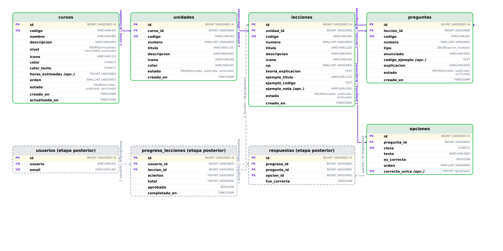

# 8. Modelo de datos (DER)

Diagrama entidad-relacion del contenido educativo de Sintaxia.

- **Archivo editable:** [`der/sintaxia-der.drawio`](der/sintaxia-der.drawio) — se abre
  en [app.diagrams.net](https://app.diagrams.net) (Archivo → Abrir desde → Dispositivo)
  o con la extension de draw.io en VS Code.
- **Vista previa:** [`der/sintaxia-der.png`](der/sintaxia-der.png)



En el diagrama, las tablas de **contorno verde** son las de esta etapa (el
contenido). Las de **contorno gris punteado** son las del avance del
participante, que se incorporan en la etapa siguiente junto con la
identificacion de usuarios.

---

## 8.1 Que representa cada nivel

| Nivel | Que es | Ejemplo |
|---|---|---|
| **Curso** | Un lenguaje completo | JavaScript |
| **Unidad** | Un bloque tematico dentro del curso | Unidad 1 - Primeros pasos |
| **Leccion** | Un tema puntual, con su teoria y sus actividades | Variables y constantes |
| **Pregunta** | Una actividad de la leccion | "Que palabra clave usar para un valor que no cambia?" |
| **Opcion** | Una de las respuestas posibles de la pregunta | `const` |

La cadena es siempre de uno a muchos:

```
1 curso  ──<  N unidades  ──<  N lecciones  ──<  N preguntas  ──<  N opciones
                                                                   (una sola correcta)
```

Cada elemento tiene su **identificador propio** (`id`, numerico y autoincremental)
y ademas un **codigo legible** (`codigo`, por ejemplo `js-u1-l2`), que es el que
usan las direcciones de la aplicacion y los archivos de prueba. Cada elemento
apunta con una clave foranea al nivel del que depende.

---

## 8.2 Tablas

### cursos

| Campo | Tipo | Clave | Obligatorio |
|---|---|---|---|
| id | BIGINT UNSIGNED AUTO_INCREMENT | **PK** | si |
| codigo | VARCHAR(40) | UNIQUE | si |
| nombre | VARCHAR(80) | | si |
| descripcion | VARCHAR(400) | | si |
| nivel | ENUM('principiante','intermedio','avanzado') | | si |
| icono | VARCHAR(10) | | si |
| color | CHAR(7) | | si |
| color_texto | CHAR(7) | | si |
| horas_estimadas | TINYINT UNSIGNED | | no |
| orden | SMALLINT UNSIGNED | | si |
| estado | ENUM('borrador','publicado','archivado') | | si |
| creado_en | TIMESTAMP | | si |
| actualizado_en | TIMESTAMP | | si |

**Restricciones:** `UNIQUE (codigo)` · `CHECK (color LIKE '#______')`

### unidades

| Campo | Tipo | Clave | Obligatorio |
|---|---|---|---|
| id | BIGINT UNSIGNED AUTO_INCREMENT | **PK** | si |
| curso_id | BIGINT UNSIGNED | **FK** → cursos(id) | si |
| codigo | VARCHAR(40) | UNIQUE | si |
| numero | SMALLINT UNSIGNED | | si |
| titulo | VARCHAR(120) | | si |
| descripcion | VARCHAR(400) | | si |
| icono | VARCHAR(40) | | si |
| color | VARCHAR(40) | | si |
| estado | ENUM('borrador','publicado','archivado') | | si |
| creado_en | TIMESTAMP | | si |

**Restricciones:** `UNIQUE (curso_id, numero)` — no puede haber dos unidades 3 en
el mismo curso · `FK ON DELETE CASCADE` · `CHECK (numero > 0)`

### lecciones

| Campo | Tipo | Clave | Obligatorio |
|---|---|---|---|
| id | BIGINT UNSIGNED AUTO_INCREMENT | **PK** | si |
| unidad_id | BIGINT UNSIGNED | **FK** → unidades(id) | si |
| codigo | VARCHAR(40) | UNIQUE | si |
| numero | SMALLINT UNSIGNED | | si |
| titulo | VARCHAR(120) | | si |
| descripcion | VARCHAR(400) | | si |
| icono | VARCHAR(40) | | si |
| xp | SMALLINT UNSIGNED | | si |
| teoria_explicacion | TEXT | | si |
| ejemplo_titulo | VARCHAR(120) | | si |
| ejemplo_codigo | TEXT | | si |
| ejemplo_nota | VARCHAR(300) | | no |
| estado | ENUM('borrador','publicado','archivado') | | si |
| creado_en | TIMESTAMP | | si |

**Restricciones:** `UNIQUE (unidad_id, numero)` · `FK ON DELETE CASCADE` ·
`CHECK (xp > 0)`

La teoria vive en la propia leccion porque es uno a uno: cada leccion tiene
exactamente una explicacion y un ejemplo. Separarla en otra tabla solo agregaria
un JOIN sin ganar nada.

### preguntas

| Campo | Tipo | Clave | Obligatorio |
|---|---|---|---|
| id | BIGINT UNSIGNED AUTO_INCREMENT | **PK** | si |
| leccion_id | BIGINT UNSIGNED | **FK** → lecciones(id) | si |
| codigo | VARCHAR(40) | UNIQUE | si |
| numero | SMALLINT UNSIGNED | | si |
| tipo | ENUM('opcion_multiple') | | si |
| enunciado | VARCHAR(500) | | si |
| codigo_ejemplo | TEXT | | no |
| explicacion | VARCHAR(600) | | si |
| estado | ENUM('borrador','publicado','archivado') | | si |
| creado_en | TIMESTAMP | | si |

**Restricciones:** `UNIQUE (leccion_id, numero)` · `FK ON DELETE CASCADE`

`tipo` es un ENUM con un solo valor por ahora. Se deja asi para poder sumar
`verdadero_falso`, `completar` u `ordenar` mas adelante sin cambiar la
estructura de la tabla.

### opciones

| Campo | Tipo | Clave | Obligatorio |
|---|---|---|---|
| id | BIGINT UNSIGNED AUTO_INCREMENT | **PK** | si |
| pregunta_id | BIGINT UNSIGNED | **FK** → preguntas(id) | si |
| clave | CHAR(1) | | si |
| texto | VARCHAR(300) | | si |
| es_correcta | BOOLEAN | | si |
| orden | SMALLINT UNSIGNED | | si |
| correcta_unica | TINYINT (columna generada) | UNIQUE | no |

**Restricciones:** `UNIQUE (pregunta_id, clave)` · `FK ON DELETE CASCADE` ·
`CHECK (clave IN ('a','b','c','d'))`

#### Como se garantiza una unica respuesta correcta

Esta es la restriccion mas interesante del modelo. MySQL no tiene indices unicos
parciales, asi que no se puede escribir directamente "una sola fila con
`es_correcta = 1` por pregunta". La solucion es una **columna generada**:

```sql
correcta_unica TINYINT GENERATED ALWAYS AS (IF(es_correcta, 1, NULL)) STORED,
UNIQUE KEY uq_una_correcta (pregunta_id, correcta_unica)
```

La columna vale `1` cuando la opcion es correcta y `NULL` cuando no lo es. Como
MySQL **no compara los NULL entre si** en un indice unico, las opciones
incorrectas no chocan entre ellas, pero dos correctas de la misma pregunta
intentarian insertar el mismo par `(pregunta_id, 1)` y la base lo rechaza.

Eso asegura **a lo sumo una** correcta. Para asegurar **al menos una**, la
validacion se hace al cargar el contenido (una pregunta sin respuesta correcta se
rechaza antes de publicarse), porque una restriccion de tabla no puede mirar
cuantas filas hijas existen.

---

## 8.3 Publicacion del contenido y avance del participante

La consigna pide distinguir dos cosas que suelen confundirse:

| | Estado de publicacion | Avance del participante |
|---|---|---|
| **De quien es** | Del contenido: es igual para todos | De cada persona |
| **Quien lo cambia** | Quien escribe el curso | El estudiante, al practicar |
| **Donde vive** | Campo `estado` en cursos, unidades, lecciones y preguntas | Tablas `progreso_lecciones` y `respuestas` |
| **Valores** | borrador / publicado / archivado | sin empezar / completada / aprobada |

> Una leccion puede estar **publicada** para todos y, al mismo tiempo, estar
> **aprobada** por un solo usuario. Son dos ejes independientes: el contenido no
> guarda nada del estudiante, y el progreso no guarda nada del contenido mas alla
> de a que leccion apunta.

Por eso el `estado` de publicacion vive en las tablas de contenido, y **no hay
ningun campo de avance en ellas**. En el diagrama, las tablas del avance estan
dibujadas con contorno punteado: se agregan en la etapa siguiente.

---

## 8.4 De los archivos de prueba a la base

Hoy el contenido esta en archivos JavaScript (`src/data/`) y la aplicacion lo
pide siempre al modulo `src/servicios/contenido.js`. La correspondencia es
directa:

| Archivo de prueba | Tabla |
|---|---|
| `src/data/cursos.js` | cursos |
| `src/data/unidades.js` | unidades |
| `src/data/lecciones/unidad*.js` | lecciones (campo `teoria`) |
| el array `ejercicios` de cada leccion | preguntas |
| el array `opciones` de cada ejercicio | opciones |

Cuando el contenido pase a la base, se reemplazan las funciones de
`contenido.js` por consultas y **ninguna pantalla cambia**: ya son asincronas y
devuelven la misma forma de datos.
